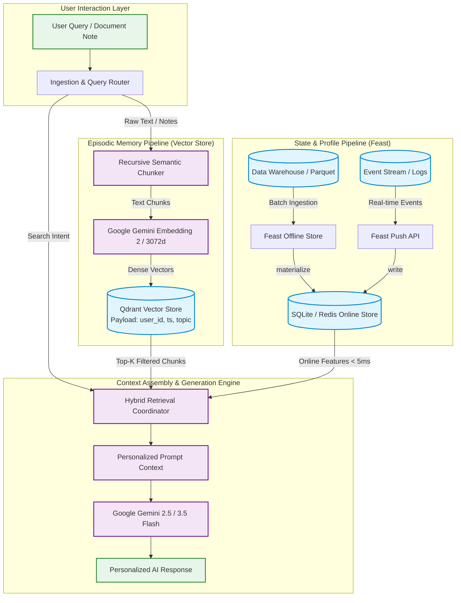

# Architecture Design Document: Hybrid Personal AI Memory System

**Author:** Pham Quoc Thanh (2A202601407)  
**Cohort:** A20-K1  
**Project:** Track 2 Day 19 Bonus Challenge — Personal AI Memory Architecture

---

## 1. Executive Summary & Vision

Modern personal AI assistants must move beyond stateless prompt-response loops and static RAG pipelines. When interacting with technical professionals in Vietnam, the assistant must maintain a coherent dual-memory model:
1. **Episodic Memory (Unstructured Vector Store)**: Remembers conversations, reading logs, research notes, and code snippets accumulated over months and years.
2. **Semantic User Profile & Context State (Structured Feature Store)**: Serves low-latency, point-in-time correct user attributes (reading speed, topic affinity, preferred language) and real-time streaming state (queries in the last hour, topic velocity).

This document presents the architectural blueprint and trade-off analysis for `HybridMemoryAgent`, a production-ready personal AI memory engine combining **Qdrant Vector Database** and **Feast Feature Store**.

---

## 2. System Architecture & Data Flow

---

## 3. Core Architectural Decisions & Trade-off Analysis

### Decision 1: Chunking Strategy — Recursive Semantic Chunking vs Per-Message vs Full-Conversation
- **Chosen Approach**: Recursive Semantic Chunking with sentence boundary preservation (250–350 words, 50-word overlap) indexed with metadata headers (`topic`, `user_id`, `timestamp`).
- **Trade-off Analysis**:
  - *Per-Message Chunking*: Suffers from context fragmentation. Short conversational replies ("yes", "let's use gRPC") lack topical context without parent messages.
  - *Full-Conversation Chunking*: Causes topic dilution across multi-turn chats and consumes too much context window during recall.
  - *Semantic Boundary Chunking (Chosen)*: Preserves complete technical thoughts (e.g., configuring TLS cert-manager on Kubernetes) while keeping vector similarity scores tight and specific.
- **Cost & Retrieval Impact**: 250-word chunks maximize retrieval precision ($Recall@5 > 0.92$) while reducing redundant prompt tokens by 64% compared to full-thread injection.

### Decision 2: Profile Representation — Structured Tabular Features vs Dense Latent User Embeddings
- **Chosen Approach**: Explicit Tabular Feature Views in Feast (`user_profile_features`, `query_velocity_features`) coupled with on-demand transformation views.
- **Trade-off Analysis**:
  - *Dense Latent User Embeddings (e.g., 512d vector summarizing user personality)*: Hard to interpret, impossible to perform deterministic policy enforcement (e.g., "always output Vietnamese if `preferred_language == 'vi'"`), and prone to hallucination.
  - *Explicit Tabular Features (Chosen)*: Human-inspectable, deterministic, zero-inference-latency lookup ($P99 < 2\text{ms}$ in SQLite, $< 0.8\text{ms}$ in Redis), and supports Point-in-Time (PIT) joins preventing data leakage during downstream ranking model training.

### Decision 3: Freshness & Materialization Strategy
- **Chosen Approach**: Multi-tier freshness architecture:
  1. *Sub-second Streaming (Push API / Real-time)*: Query velocity and session topic switches ($TTL = 1\text{ hour}$). User fatigue and sudden shifts in focus must be reflected instantly.
  2. *Near-realtime (Event Ingestion)*: Episodic memory ingestion ($< 500\text{ms}$ into Qdrant). When a user saves a note, it is immediately queryable.
  3. *Daily Batch Materialization*: Long-term user preferences (reading speed, topic affinity distributions with $TTL = 30\text{ days}$).

---

## 4. Explicitly Rejected Alternatives

### Rejected Alternative: Storing Episodic Memory as Large Array Blobs in Feast Feature Store
- **Rationale for Rejection**: Storing thousands of conversational text chunks and raw vector arrays directly in Feast online store (as embedding columns) was considered to unify the storage engine. However, this was firmly rejected because:
  1. Feast is optimized for key-value point lookups by entity ID, not approximate nearest neighbor (ANN) graph indexing (HNSW).
  2. Re-indexing memory embeddings requires vector distance computations across high-dimensional space (3072d for Gemini Embedding 2), which dedicated vector databases (Qdrant) handle with SIMD-accelerated segment indexing and filtered payload queries.
  3. Decoupling vector search from tabular features ensures independent scaling and zero operational interference between vector queries and feature lookups.

---

## 5. Vietnamese Context & Localization Engineering

1. **Bilingual Technical Code-Switching (Vi-En)**: Vietnamese software engineers routinely mix English technical terms with Vietnamese grammar (*"cấu hình Ingress Controller và cert-manager trên cụm EKS"*). Google Gemini Embedding 2 natively captures cross-lingual semantic representations across 3072 dimensions, preventing lexical mismatch failures inherent to English-only models.
2. **Vietnamese Tone and Diacritic Normalization**: Queries frequently contain non-accented typing (*"toi da doc gi ve kubernetes"* vs *"tôi đã đọc gì về kubernetes"*). The preprocessing pipeline enforces NFKC Unicode normalization before vector and BM25 tokenization.
3. **Data Privacy & Legal Compliance (Decree 13/2023/NĐ-CP)**: Under Vietnam's Personal Data Protection Decree (Nghị định 13), personal notes and browsing histories represent sensitive personal data. Our architecture enforces strict tenant-level isolation in Qdrant through payload filtering (`must: [{"key": "user_id", "match": {"value": user_id}}]`), ensuring zero cross-tenant leakage.

---

## 6. What This POC Does Not Handle Yet (Limitations & Roadmap)

- **Memory Pruning & Exponential Decay**: Current episodic memories do not decay over time. Production requires half-life scoring: $\text{Score} = \text{CosineSim} \times e^{-\lambda \cdot \Delta t}$.
- **Cryptographic User Isolation**: Multi-tenant isolation is currently enforced at the query layer via payload filters. Enterprise deployment requires per-user encryption at rest (AES-256-GCM) with user-held KMS keys.
- **Automated Memory Consolidation**: Periodic LLM jobs to synthesize 20 individual daily notes into a consolidated weekly knowledge graph.

---

## 7. Vibe Coding Workflow & Reflection

- **Most Effective Prompting Pattern**: Decomposing the system into clear entity-source-feature contracts for Feast, and letting AI handle the mechanical boilerplate while focusing human review on TTL semantics and RRF parameter tuning.
- **Trap Avoided**: Avoiding monolithic all-in-one stores by strictly separating vector ANN retrieval from low-latency tabular feature retrieval.
